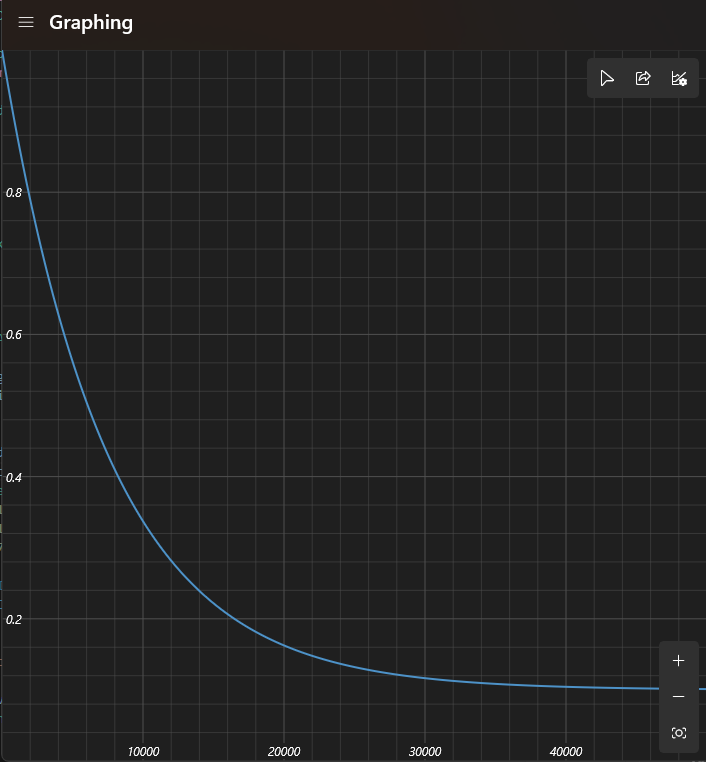
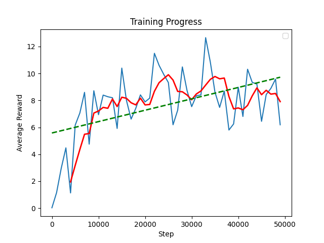

# Snake Reinforcement Learning

This repository is where I will be designing a training enviroment for the famous Snake Game.

It will also serve as a way of me learning AI and RL systems on my own.

# Methods

### Python

I will be using Python as the main programming language.

## Strategies

### Epsilon Formula (Code)

```py
eps_threshold = self.epsilon_end + (self.epsilon - self.epsilon_end) * np.exp(
    -1.0 * self.steps_done / self.epsilon_decay
)
```

### Epsilon Formula

# $$ f(x) = b + (a - b) \cdot e^{-\left( \frac{x}{c} \right)} $$

- **a = Epsilon**
- **b = Epsilon End**
- **c = Epsilon Decay**
- **x = Steps Passed**

### Epsilon Function (Example)

This is more or less what happens to the epsilon value during training, this way, at the start the epsilon is high, meaning the actions taken are mostly random, when we get closer to 50 000 steps, the epsilon value will be much lower, allowing it to use what it has learned during training.

With the following image you can get an accurate representation of the epsilon changes during the training process.



## AI Libraries

### PyTorch

The main library I will be using is `PyTorch`, I will not be using `TensorFlow` due to it's requirement of a Unix based system.

## Telemetry

During the training process, the program initiates a **plot** to show the average reward every **X** ammount of steps.

It then saves the plot to a png matching the file name with the checkpoint saved.



## Run Commands

### Train Mode

1. **Run** `cd snake-rl`

2. **Run** `python -m dqn.train`

### Play Mode

1. **Run** `cd snake-rl`

2. **Run** `python -m dqn.play`
   $$
